# django-blog
A complete blogging application with user authentication and authorization, dashboard, comments and responsive design.

# features:
* Blog home page where users can see all the blogs, login and logout options. 
* Users can only view the limited details of each blog. For advance features like to create post and comment on any post, they must need to register and login.
* Register new user, login and logout sessions. The Django authentication system is being used handles both authentication and authorization.
* @Login_required decoraters is being used to only allowed logged in users to view dashboard, create post and comment.
* Custom dashboard for each user to create and view draft and future date posts.
* Django messaging framework to display custom messages.
* A dynamic search engine which used optimized query sets “Q” to filter from title, content, user’s first and last names. If no match found, it will display a message "Sorry No Result Found, Try Again..!”.
* Custom navbar to stay visible on scrolldown and back to the top button to get back to the top.
* Slide in effects on scrolldown from left to right.
* Responsive design for any screensize.
* Scalable pagination to display only three post at single page with navigation bar.

# Steps to run:

### Step 1:
Create a folder.

$ mkdir django_blog

Create a virtual enviroment.

$pip install virtualenv

$ cd django_blog

$ virtualenv env

$ source env/bin/activate

### Step 2:
Install requirements.txt

$pip install -r requirements.txt

### Step 3:
Edit settings.py with database credentials.

  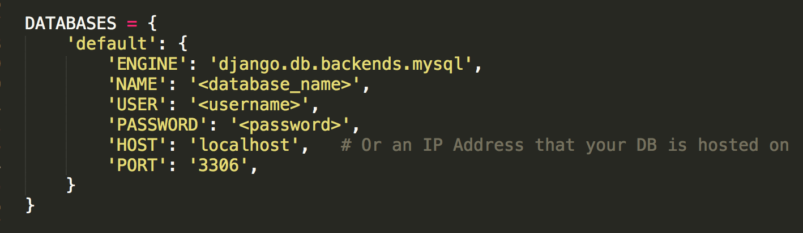

### Step 4:
Database migrations.

$ python manage.py makemigrations

$ python manage.py migrate

### Step 5:
Run project.

$ python manage.py runserver

### Folder Structure.

  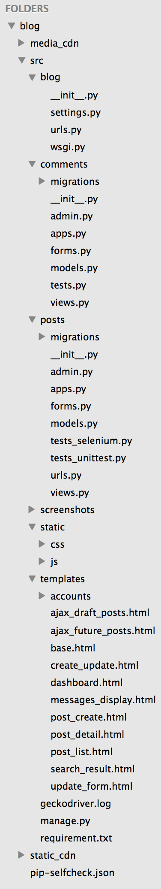

### User table in database.

  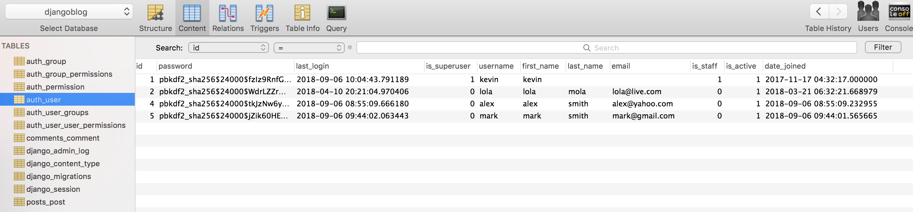

### Comments table in database.

  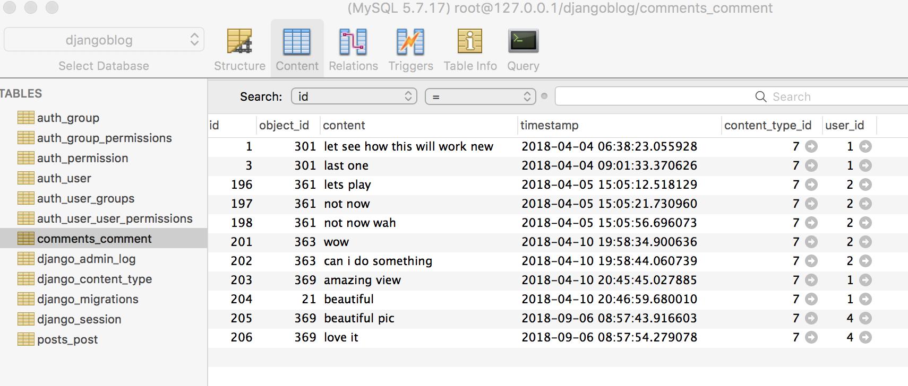

# ---------------------------- Demo -------------------------------
#### Home page
http://127.0.0.1:8000/posts/ is a home page which displays all posts posted by the user. This page also display options to login, register, search, pagination to next 3 post. Users can only see the post image, title, date, author name and first few lines of the post. To view the whole post and comment, user must login or register. 

  

#### Responsive Navbar.
On scroll down, navbar will change its position and moves down along the page

  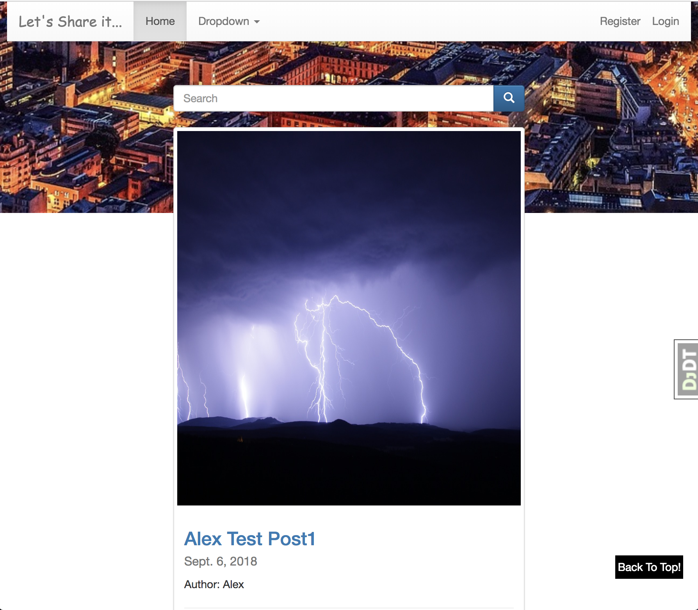

#### Login
Django authentication framework is being used to validate the username and password and perform login, logout operations. If either of it is wrong, it will prompt a custom error message. On success, it will show a custom messages. It will also give an option to register if user is not registered yet.

  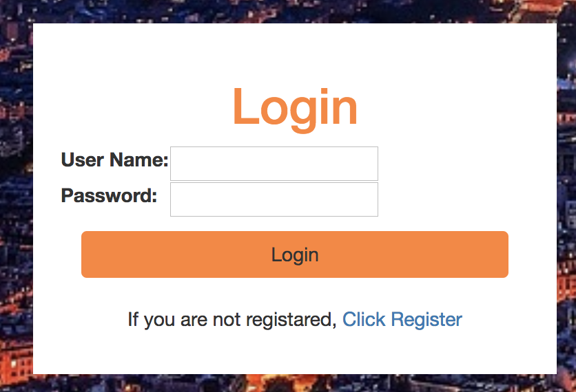

Error if username or password is not corrent.

  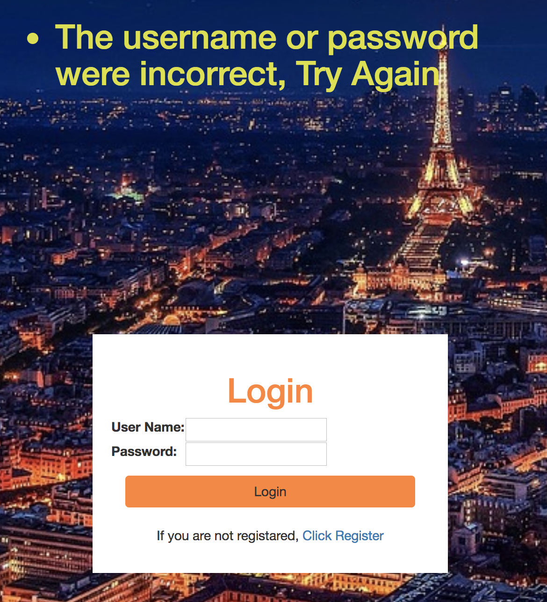

#### Register.
Register a new user and validate their credentials. If the username is already exists or password is not is correct, it will display an error messages. Form validation is been used to check whether both password fields must for the successful registration.

  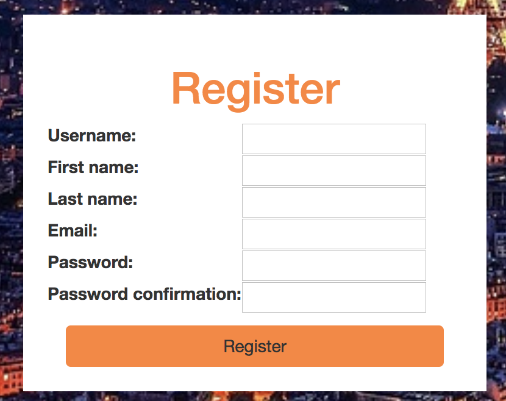

Error message if username is already exists.

  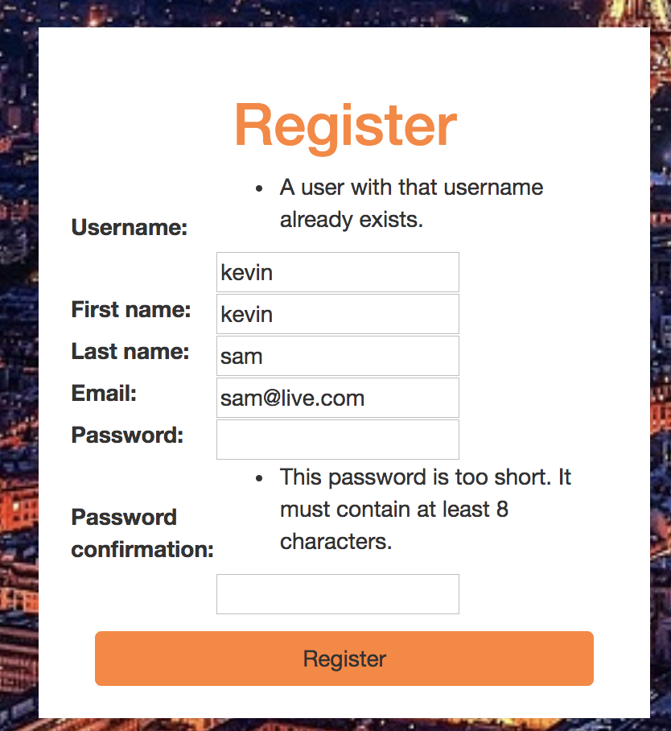

Error message if both password fields doesn't match.

  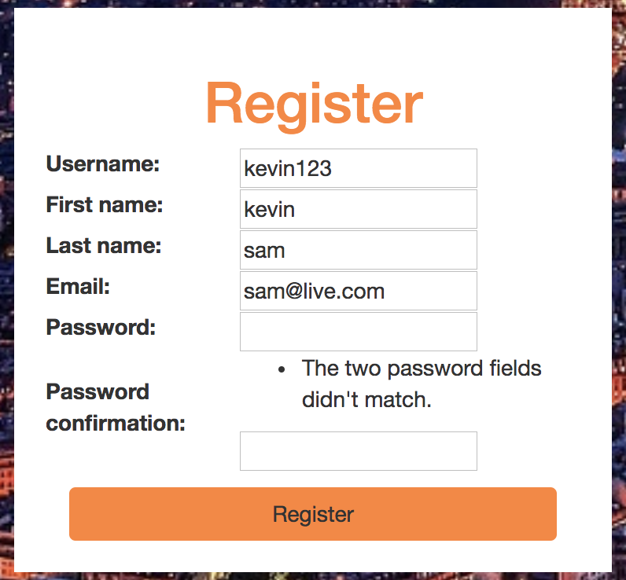

#### Dashboard
Once user is been authorized, it will redirect to custom dashboard. This displays all posts related to the current logged in user. In addition to this, it will also display three options which are draft, future and create post. Each section displays related contents.

  

Onclick, display related content.

  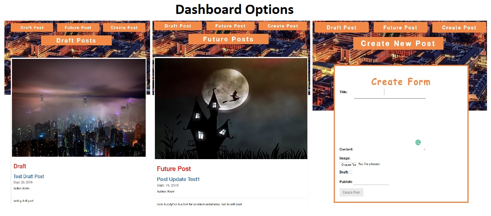

Create post calendar using JQueryui datepicker.

  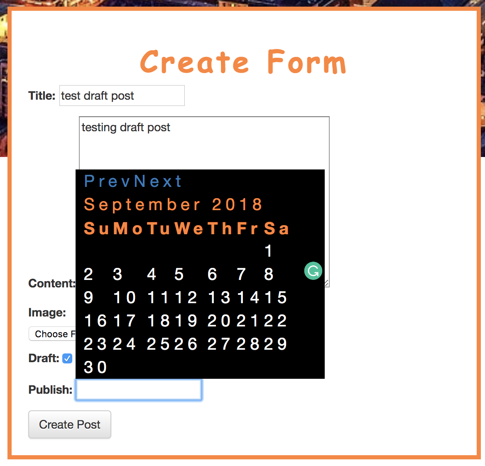

#### Comment.
A dynamic commenting functionality enable users to comment at any post once they successfully logged in. Ajax is been used to handle comments without refreshing the page.

  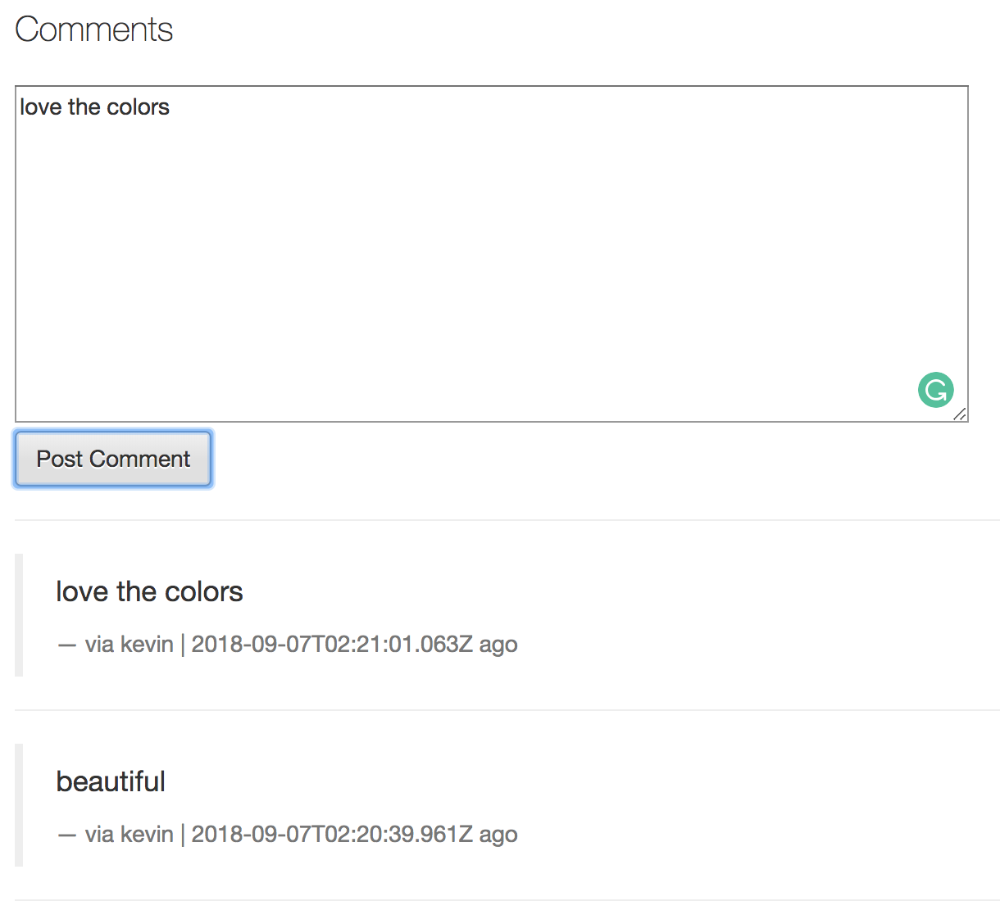

